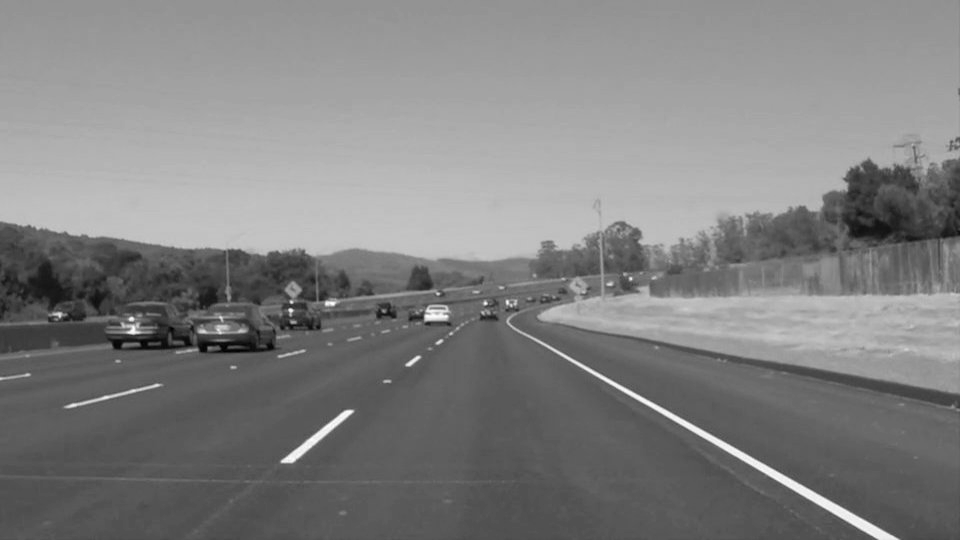
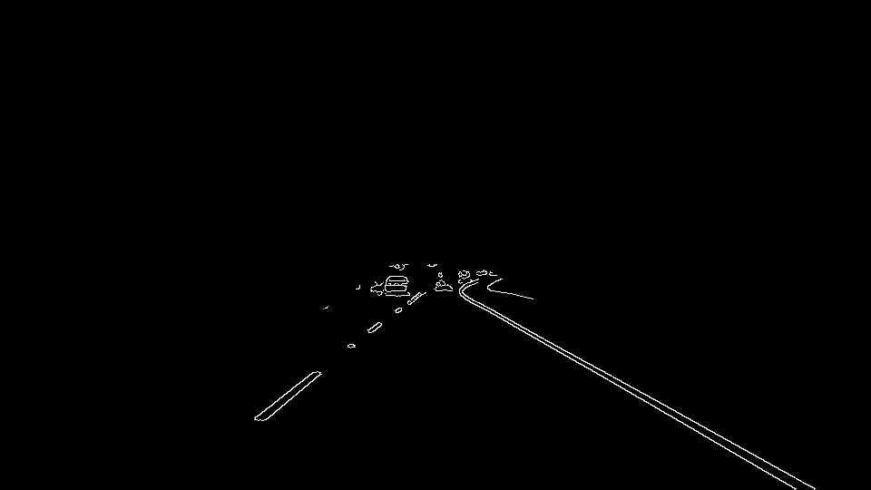
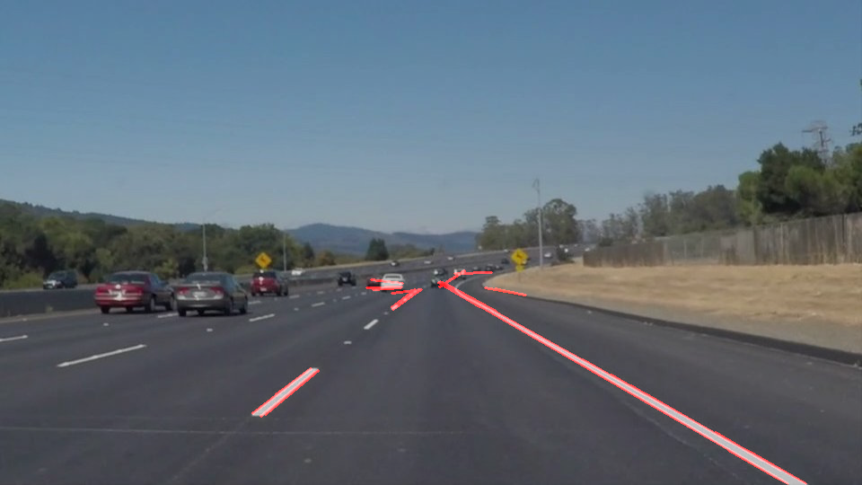
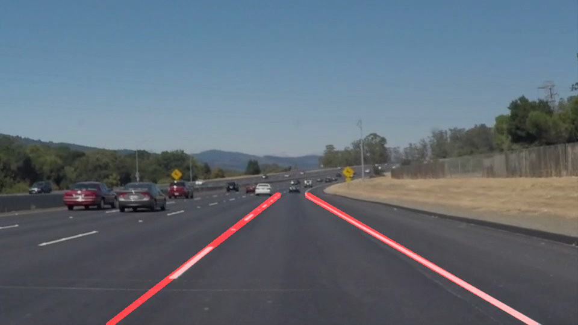
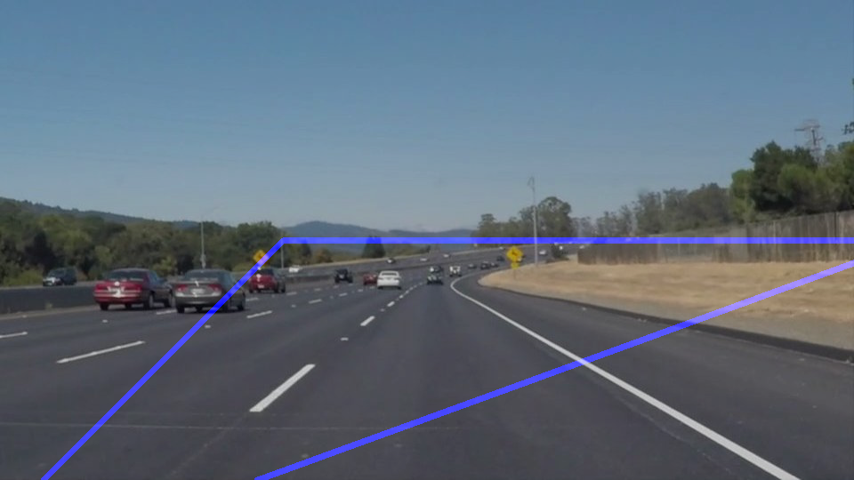
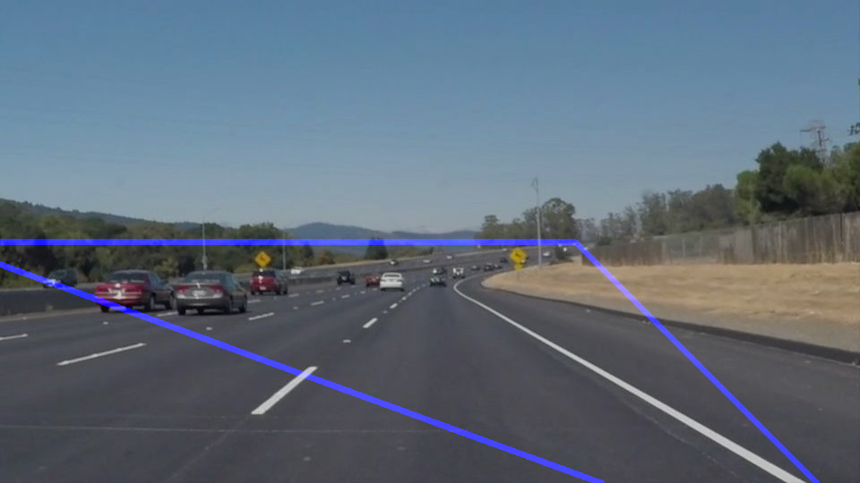

# **Finding Lane Lines on the Road** 

### Goal

The goals of this project are the following:
* Make a pipeline that finds lane lines on the road
* Reflect on your work in a written report


[//]: # (Image References)

[image1]: ./examples/grayscale.jpg "Grayscale"

---

### Reflection

### 1. Main pipeline. 

My pipeline consisted of 6 steps. 

1. I converted the images to grayscale if necessay.


2. I applied Gaussian Blur on the gray image.


3. Then I applied Canny filter to do edge detection.


4. I masked edge with a predefined interested region.


5. I applied hough transform to find straight line segments


6. I used reduce_lines() function to reduce all straight line segments into the signle left and the signle right lane lines.


### 2. Reduce lines pipeline. 

reduce_lines() function is to reduces all straight line segments into the signle left and the signle right lane lines.  It consists 3 steps.   We also reversed y coordinate updown, so that y=0 is corresponding to the bottom line of the image.

Step 1. I converted all line segment (x1, y1, x2, y2) into parameter form (x0, theta, line_length), where x0 is the line cross x-position at y=0, theta is the angle between line and x-axis, and line_length is the length of the line segment.  So that, line equation is $y = (x-x0) * tan(theta)$

```

            Y ^ 
              |       * (x2, y2)
              |      /
              |     * (x1, y1)
              |    /
              |   / theta
        (0,0) |------------> X
                (x0,0)

```

Step 2. I filtered out the invaid line segments by a predined x0 range and theta range.  For the left line, $x0$ sholud be between $0.05 * image\_width$ and $0.30 * image\_width$ and $theta$ should be between 20 and 45 degrees.  Similarly, for the right line, $x0$ sholud be between $0.70 * image\_width$ and $0.95 * image\_width$ and $theta$ should be between 135 and 160 degrees.  The following image shows the boundary of valid regions.

left valid region

right valid region

Step 3. We average the line crose angle (theta) and x-position (x0) intead of coefficients. We used the line segment length as its weight. After average, we draw the average lines from $y=0$ to $y=0.4 * image\_height$.


### 3. Improved part for the challenge video. 

The edge dectection in the challenge video became more difficult because

1. there are a lot of shadows of trees
2. the road color is not so uniformed
3. the constrast of the left yellow land is not so obvious
4. the right land is not always clearly visible.

The first and second causes are not so critical. Most of their edges are filtered out because their orientation. Even they has similar orientation as the lane line, it has a small weight of averaging because of its short length.

For the third pard, because yellow line is different color from the road, it would be easier to seperate on color space. So our ad hoc method is convert color image into a hsv image instead a gray image. Then we do edge detect in H, S, V domain image seperately. All detected edges are the candidates of the reduce_lines() function.  It is implemented in our project.

The fourth may be able be handled by dynamic threshold to do edge detection.

### 4. Identify potential shortcomings with your current pipeline


For code simplicity, we used a lot of hard coded parameters.  The edge detetction is not so robustly when the edge constrast is not so clearly. The interested region is also hard coded.  It may fail if the camera is moved.  The algorithm of reduce_lines() is not well mathmatically defined.  It may be defined more precisely. 

Furthermore, we assumed lane line existed. We didn't handle the extraordinary cases such as without lane line.

We didn't use temporary time-frame relation. The temporary time-frames should be highly related.  The system would become much robustness if we well use temporary time-frames.


### 5. Suggest possible improvements to your pipeline

A possible improvement is to remove the hard coded parameters.  Instead, it should use the dynamic parameters determined by the previous time frames.    For examples, we can use the standard devation of image intensity to determine the Canny filter threshold.    

The interested mask region also tracked by the following time frames.  It should be able handle the camera small vibration issue when car moving.

If there is no existed lane line, the system should be able to detect it and call the $no\_lane\_line$ handle routine.


